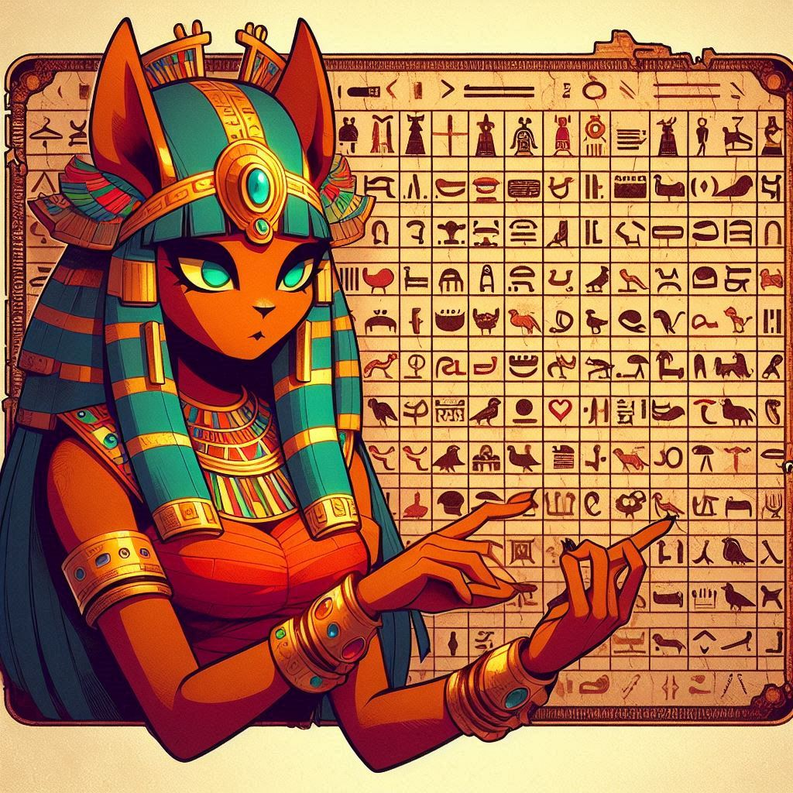

# 🛡️ Encriptador de Texto

## 🚀 Descripción del Proyecto

El **Encriptador de Texto** es una herramienta que permite a los usuarios encriptar y desencriptar mensajes de manera segura. Está diseñado para transformar texto utilizando una técnica simple que cambia las mayúsculas a minúsculas y corrige puntos y caracteres especiales. Ideal para mantener tus mensajes secretos seguros y privados.

## 📜 Estado del Proyecto

<h4 align="center"> 
    ✅ Proyecto Completado ✅
</h4>

## 🛠️ Funcionalidades

- 🔐 **Encriptación de texto:** Transforma texto claro en un formato encriptado.
- 🔓 **Desencriptación de texto:** Convierte el texto encriptado de vuelta a su forma original.
- 🛠️ **Corrección automática:** Corrige puntos y caracteres especiales durante la encriptación.
- 🔄 **Transformación de mayúsculas:** Cambia todas las letras mayúsculas a minúsculas para mayor consistencia.

## 📂 Acceso al Proyecto

Puedes acceder al proyecto y probar la herramienta directamente en tu navegador.

- **Repositorio en GitHub:** [Encriptador de Texto](https://github.com/valko-dev/encriptador-de-texto)

## 🛠️ Tecnologías Utilizadas

- 🖼️ **HTML5:** Para la estructura del contenido.
- 🎨 **CSS3:** Para el diseño y la presentación visual.
- 💻 **JavaScript:** Para la lógica de encriptación y desencriptación.
- 🖌️ **Bing:** Para la creación de imágenes.

## 🤝 Contribuyentes

| [ Valeria Kocar A.](https://github.com/valko-dev) |
| :---: |

## 📜 Licencia

Este proyecto está bajo la licencia MIT. Para más detalles, consulta el archivo [LICENSE](LICENSE).

## 🎨 Créditos de Imágenes

- **Imagen de símbolos egipcios:** [Imagen de freepik](https://www.freepik.es/vector-gratis/simbolos-dioses-egiptos-estilo-dibujado-mano_2720717.htm#query=egipcios&position=2&from_view=search&track=ais_hybrid&uuid=d9cd4189-4512-4121-9d2d-9008733de0a4)

---

*Desarrollado por Valeria Kocar A.*

  
  

